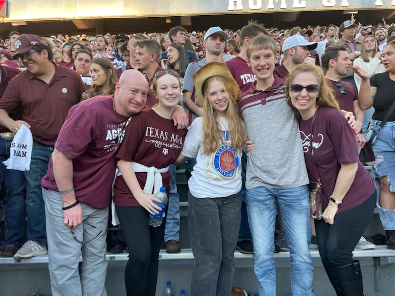

When I was eight, my father purchased an Apple 2.  We were the first of my friends to have a computer at home.  Although too young to understand the full capabilities of this primitive 32 KB machine, I became interested enough to learn some basic DOS commands.   As the years passed, I combined my love of computers with sports.  Specifically, I loved baseball and more specifically, the statistics surrounding the sport! I found myself immersed in anything associated with numbers.  I enjoyed trending all sorts of data in Lotus spreadsheets.  

In college, I obtained both a B.S and M.S in chemical engineering. I began a career with Chevron Phillips (originally Phillips Petroleum Company) and stayed for twenty-one years.  I was blessed to hold a variety of roles, including Research Engineer, Operations and Process Engineer, Operations Team Leader, Process Safety Manager and Operations Superintendent.  

Over the last two years, I decided to add a statistical and modeling component to my career.   I've developed a data science skillset through the completion of boot camps and classes.

[Mike Hankinson's LinkedIn Profile](https://www.linkedin.com/in/mike-hankinson-b26a4b5/)

(Although I am an Oklahoma Sooner, our son is Texas A&M Aggie.  This picture is of our family enjoying a football game in the fall of 2021)

